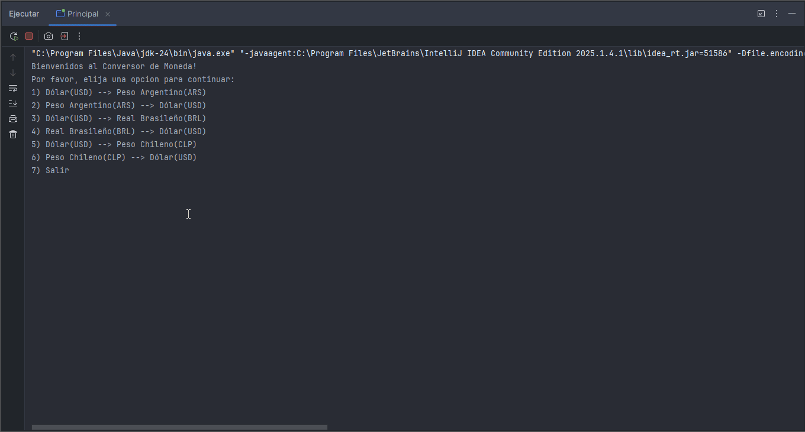

# 💱 Challenge Alura - Conversor de Monedas

Este proyecto forma parte del **Challenge Back-End de Alura Latam**, donde el objetivo es desarrollar un **Conversor de Monedas** que permita convertir valores entre diferentes divisas utilizando una **API externa**.

---

## 🚀 Descripción del Proyecto

El **Conversor de Monedas** es una aplicación desarrollada en **Java**, que realiza conversiones entre diferentes monedas utilizando la **API ExchangeRate API** para obtener tasas de cambio actualizadas en tiempo real.

El usuario puede ingresar una cantidad y seleccionar las monedas de origen y destino, y el programa devuelve el valor convertido de forma precisa.

---

## 🧠 Tecnologías y Herramientas Utilizadas

- ☕ **Java** – Lenguaje principal del proyecto
- 🌐 **ExchangeRate API** – Fuente de datos de tasas de cambio
- 🧩 **Gson** – Librería para el manejo y parseo de JSON
- 🧪 **Postman** – Herramienta utilizada para probar las solicitudes HTTP y analizar las respuestas de la API
- 🖥️ **IntelliJ IDEA**

---

## ⚙️ Funcionamiento

1. El programa realiza una solicitud HTTP a la **ExchangeRate API**.
2. Recibe un archivo **JSON** con las tasas de conversión actualizadas.
3. Utiliza **Gson** para transformar ese JSON en objetos Java.
4. Calcula y muestra el resultado de la conversión al usuario.

---

### 🧾 Ejemplo de Uso

#### Menú principal:

💰 **Opciones disponibles:**

- 🇺🇸 Dólar (USD) → 🇦🇷 Peso Argentino (ARS)
- 🇦🇷 Peso Argentino (ARS) → 🇺🇸 Dólar (USD)
- 🇺🇸 Dólar (USD) → 🇧🇷 Real Brasileño (BRL)
- 🇧🇷 Real Brasileño (BRL) → 🇺🇸 Dólar (USD)
- 🇺🇸 Dólar (USD) → 🇨🇱 Peso Chileno (CLP)
- 🇨🇱 Peso Chileno (CLP) → 🇺🇸 Dólar (USD)
- 🚪 Salir

### 🎥 Demostración del programa:



---

## 🔑 API Utilizada

**ExchangeRate API**🔗 [https://www.exchangerate-api.com/](https://www.exchangerate-api.com/)

> Esta API permite obtener tasas de cambio actualizadas para múltiples divisas mediante peticiones HTTP en formato JSON.

---

## 🧰 Dependencias

Para ejecutar el proyecto correctamente, es necesario tener:

- **Java 17** o superior
- **Gson**
  ```xml
  <dependency>
      <groupId>com.google.code.gson</groupId>
      <artifactId>gson</artifactId>
      <version>2.10.1</version>
  </dependency>

  ```

## 📦 Instalación y Ejecución

1. Clona este repositorio:

   ```bash
   git clone https://github.com/LucasFedericoLopez/Challenge_Alura_ConversorDeMonedas.git
   ```
2. Abrí el proyecto en tu IDE preferido (por ejemplo IntelliJ IDEA o Eclipse).
3. Agregá la dependencia de Gson si aún no está configurada.
4. Ejecutá la clase principal del programa.
5. ¡Listo! 🎉 Ya podés comenzar a convertir monedas 💰

## 🧑‍💻 Autor

**Lucas Federico Lopez**
📫 [GitHub - LucasFedericoLopez](https://github.com/LucasFedericoLopez)

---

## 🏁 Estado del Proyecto

✅ **Completado y funcional**

🔄 **Posibles mejoras futuras:**

- 🖥️ Interfaz gráfica (Swing o JavaFX)
- 💹 Soporte para más monedas y criptomonedas
- 📜 Historial de conversiones

---

### 🏆 Proyecto desarrollado como parte del curso **Back-End Java - Alura Latam**
### en colaboración con **Oracle Next Education (ONE)**.
